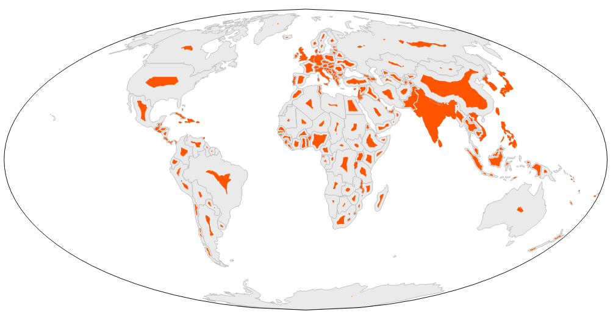

Buffer by Percentage
==================

Plugin for QGIS 2.0 for buffering polygon layers so the resulting features' area is a specified percentage of the original.

Usage of the standalone plugin:
---------
*Input vector layer*: lists all polygon layers currently loaded. Select the one you want to buffer.

*Segments to approximate*: How many segments are created per vertex. The minimum value is 1. In case of an area reduction (i.e. a percentage less than 100), this option has no effect.

*Buffer area percentage*: Select this option if you want to scale all features by the same percentage. Enter the desired percentage. With a value of 100, the feature areas will remain unchanged.

*Buffer area percentage field*: Select this option if you want to scale each feature by a percentage specified in the feature attributes. Select the desired attribute from the dropdown menu (only numerical attributes are listed).

*Output memory layer*: Select this option if you want to create a memory layer (i.e. a layer that is not written to disk) that contains the results.

*Output shapfile*: Select this option if you want to create a new shapefile that is stored in the file system. Click the *Browse* button to choose where to save the file.

*Add result to canvas*: Check this option if you want the newly created shapefile to automatically be loaded into the canvas upon completion.

Usage of the Processing plugin:
---------
*If you want to supply a single percentage value to be applied to all features, choose the "Fixed percentage buffer" algorithm. If you want to read the percentage value for each feature from an attribute, choose the "Variable percentage buffer" algorithm.

